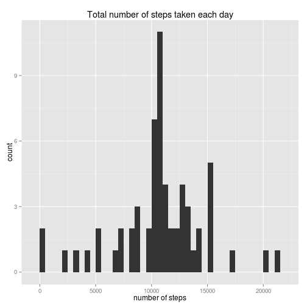

## Loading and preprocessing the data  

```r
library(plyr)
library(ggplot2)

# loading
filename <- "activity.csv"
am.rawdata <- read.csv(filename)

# preprocessing
am.data <- am.rawdata
am.data$date <- as.Date(am.data$date, format="%Y-%m-%d")
```


## What is mean total number of steps taken per day?  

```r
# summarize steps by date
am.daily <- ddply(am.data, "date", summarize, step.cnt=sum(steps))

# plot histogram
p <- ggplot(am.daily, aes(x=step.cnt)) +
    geom_histogram(binwidth=500) +
    xlab("number of steps") +
    ggtitle("Total number of steps taken each day")
print(p)
```

 

```r
# calculate mean and median
step.mean <- round(mean(am.daily$step.cnt, na.rm=TRUE),1)
step.median <- median(am.daily$step.cnt, na.rm=TRUE)
```
  
Mean total number of steps taken per day: 10766.2  
Median total number of steps taken per day: 10765


## What is the average daily activity pattern?


```r
# calculate mean number of steps per interval
am.pattern <- ddply(am.data, "interval", summarize, step.mean=mean(steps, na.rm=TRUE))

# plot daily pattern
p <- ggplot(am.pattern, aes(x=interval, y=step.mean)) +
    geom_line() +
    ylab("avg. number of steps") +
    ggtitle("Average daily activity pattern")
print(p)
```

 

```r
# find interval which has maximum step mean  
interval.maxsteps <- am.pattern[which.max(am.pattern$step.mean),"interval"]
```

Interval with maximum number of steps: 835  

## Imputing missing values  

```r
# number of rows with NA value
incomplete <- sum(!complete.cases(am.data))
```
Number of missing values in input file: 2304  

Strategy for filling missing data: 
replace missing values with mean number of steps per interval  

I rejected an option to fill missing data with mean number of steps per day  
because the number of steps varies a lot during day.  


```r
# fill missing values with mean number of steps per interval
am.merge <- merge(am.data, am.pattern, by="interval")
am.merge$steps <- ifelse(is.na(am.merge$steps),
                             round(am.merge$step.mean,0),
                             am.merge$steps
                             )

am.cleandata <- am.merge[order(am.merge$date, am.merge$interval),
                         c("steps","date","interval")]

# summarize clean data by date
am.cleandaily <- ddply(am.cleandata, "date", summarize, step.cnt=sum(steps))

# plot histogram
p <- ggplot(am.cleandaily, aes(x=step.cnt)) +
    geom_histogram(binwidth=500) +
    xlab("number of steps") +
    ggtitle("Total number of steps taken each day")
print(p)
```

 

```r
# calculate mean and median from clean data
cstep.mean <- round(mean(am.cleandaily$step.cnt, na.rm=TRUE),1)
cstep.median <- median(am.cleandaily$step.cnt, na.rm=TRUE)
```
Missing data were filled in and calculated mean and median to compare it with the   original data

Mean total number of steps taken per day: 10765.6  
Median total number of steps taken per day: 10762

The mean and median is very simmilar to the values calculated from the original  
data.  

## Are there differences in activity patterns between weekdays and weekends?

```r
# create new weekpart factor variable 
am.cleandata$weekpart <-
    factor(
        ifelse(
            weekdays(am.cleandata$date,abbreviate=TRUE) %in% c("So","Ne"),
            "weekend",
            "weekday"
        )
    )

# calculate mean number of steps by weekpart and interval
am.wpattern <- ddply(am.cleandata, c("weekpart","interval"),
                     summarize, step.mean=mean(steps))

# plot charts to compare weekday and weekend patterns
p <- ggplot(am.wpattern, aes(x=interval, y=step.mean)) +
    geom_line() +
    facet_wrap(~ weekpart, nrow=2) +
    ylab("avg. number of steps") +
    ggtitle("Average daily activity pattern")

print(p)    
```

 
